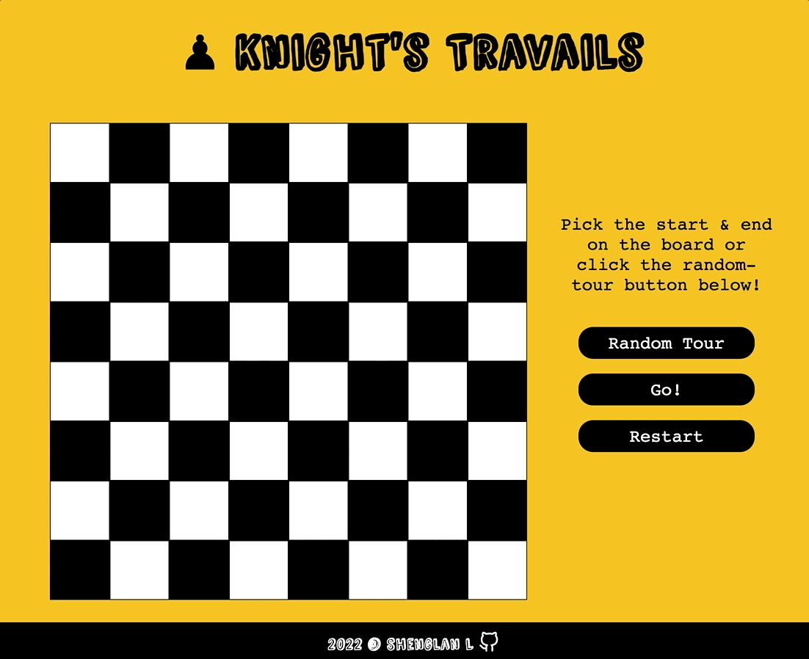

# Knight's Travails

## Demo
Click [here](https://wukongo-o.github.io/knights-travails/) to play the game! ♟ 🐴 🌵 ✨

## Description
On the chessboard, a knight can move two steps forward and one step to the side facing any direction. This app helps the knight find the shortest path from one place to any other square on the standard 8 x 8 grid. 

## Features
- Use graph data structure and breath-first search to find the shortest path
- Manually pick the start and the end on the chess board
- Randomly generate the start and the end
- Display the knight's move from the start to the destination

## Built with
Pure JavaScript, CSS, HTML, & Webpack

